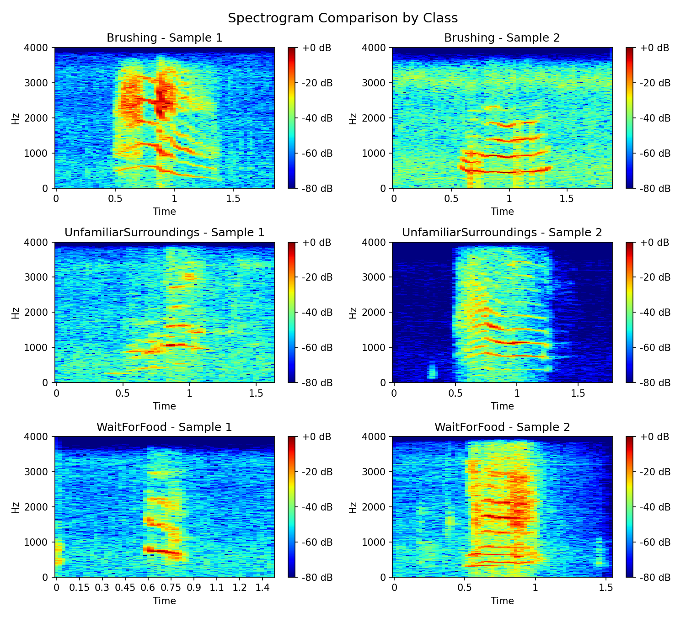
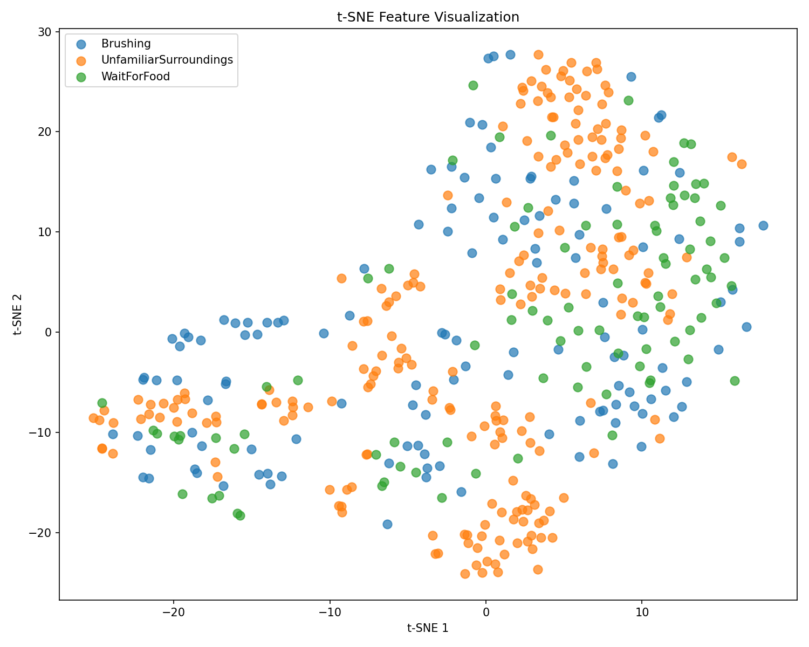
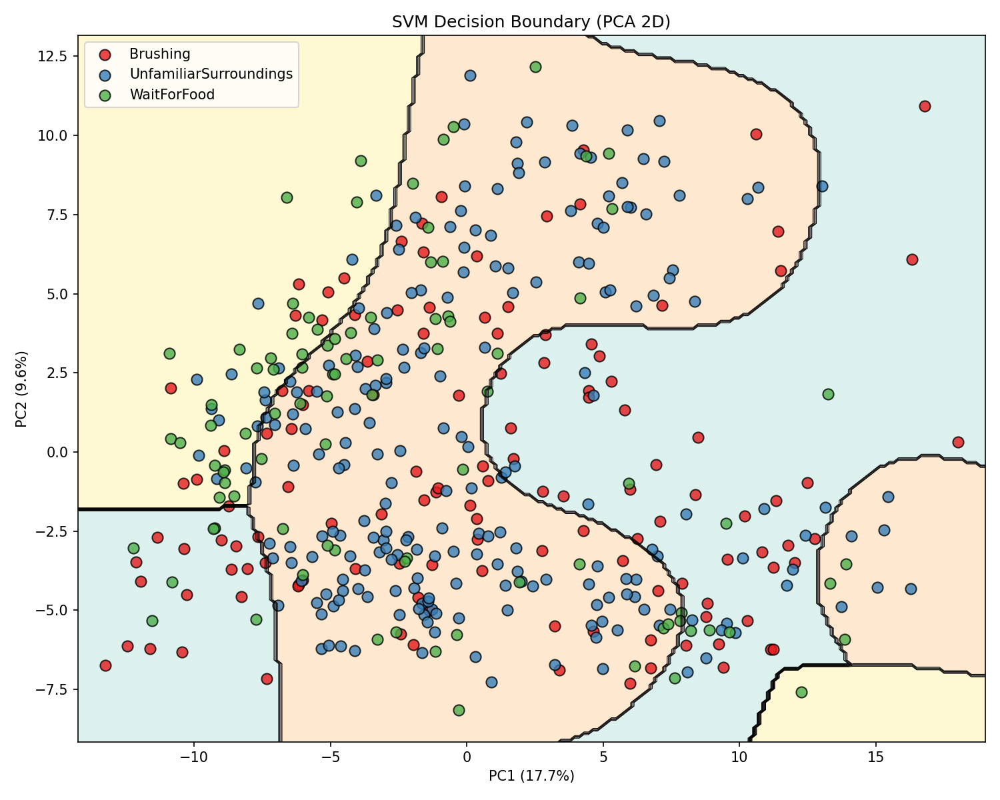
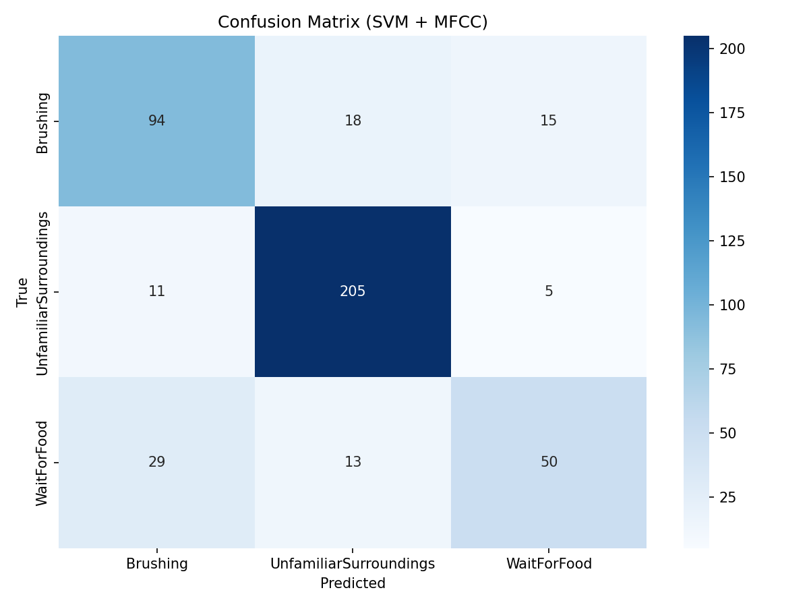
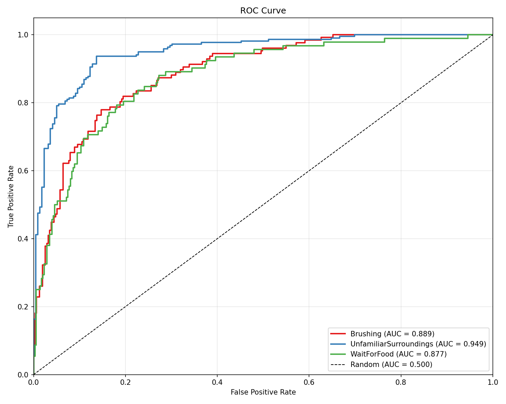
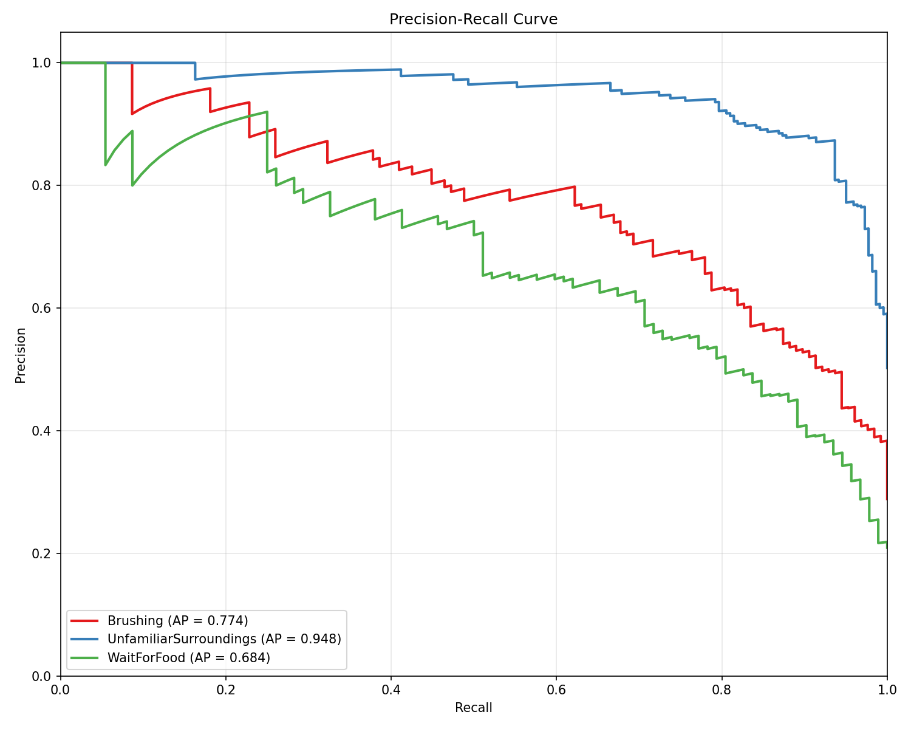

# 🐱 猫叫声识别系统 (CatMeows-Recognition)

<p align="center">
  
  
  
  
</p>

<p align="center">
  <b>基于 MFCC 特征与 SVM 分类器的猫叫声情感识别系统</b>
</p>

<p align="center">
  <a href="README-zh.md">🇨🇳 中文文档</a> | <a href="README.md">🇬🇧 English</a>
</p>

---

## 📖 项目简介

本项目实现了一个音频分类系统，能够识别不同类型的猫叫声。通过从音频信号中提取 MFCC（梅尔频率倒谱系数）特征，并使用 SVM（支持向量机）分类器，系统可以区分三种不同的猫咪行为状态：

| 类别 | 描述 |
|------|------|
| **Brushing** | 猫咪被梳毛/刷毛时的叫声 |
| **UnfamiliarSurroundings** | 猫咪在陌生环境中的叫声 |
| **WaitForFood** | 猫咪等待食物时的叫声 |

## 🚀 快速开始

### 环境要求

- Python 3.8+
- pip 包管理器

### 安装步骤

1. **克隆仓库**
```bash
git clone https://github.com/yourusername/CatMeows-Recognition.git
cd CatMeows-Recognition
```

2. **安装依赖**
```bash
pip install -r requirements.txt
```

### 使用方法

**运行训练流程：**
```bash
python run.py
```

这将执行以下步骤：
1. 从 `dataset/` 文件夹加载音频数据集
2. 从所有音频文件中提取MFCC特征
3. 执行10折交叉验证
4. 生成可视化图表并保存到 `outputs/`
5. 保存训练好的模型

## 📁 项目结构

```
CatMeows-Recognition/
├── dataset/                       # 音频数据集
│   ├── Brushing/                  # 梳毛类别样本
│   ├── UnfamiliarSurroundings/    # 陌生环境样本
│   └── WaitForFood/               # 等待食物样本
├── src/                           # 源代码
│   ├── data/
│   │   └── loader.py              # 数据集加载模块
│   ├── features/
│   │   └── mfcc.py                # MFCC特征提取
│   └── models/
│       └── svm.py                 # SVM分类器
├── tools/                         # 工具模块
│   ├── logger.py                  # 日志工具
│   └── visualization.py           # 可视化函数
├── img/                           # 示例可视化图片
├── outputs/                       # 训练输出
├── run.py                         # 主入口文件
└── requirements.txt               # 依赖列表
```

## 🔧 技术细节

### MFCC 特征提取

系统从每个音频样本中提取以下特征：

| 参数 | 值 | 描述 |
|------|-----|------|
| `n_mfcc` | 20 | MFCC系数数量 |
| `n_mels` | 26 | 梅尔滤波器组数量 |
| `win_length` | 30ms | 窗口长度 |
| `hop_length` | 20ms | 帧移长度 |
| `fmin` | 0 Hz | 最低频率 |
| `fmax` | 4000 Hz | 最高频率 |

**特征组成：**
- MFCC系数（20个）
- 一阶差分系数（Delta）
- 二阶差分系数（Delta-Delta）
- 统计池化：均值、标准差、最小值、最大值

**总特征维度：** 20 × 3 (MFCC + Δ + ΔΔ) × 4 (统计量) = **240维特征**

### SVM 分类器

| 参数 | 值 |
|------|-----|
| 核函数 | RBF（径向基函数） |
| C | 10 |
| Gamma | scale |

### 评估指标

- 准确率 (Accuracy)：整体分类准确率
- F1分数：宏平均和加权F1分数
- 精确率/召回率：各类别及宏平均
- AUC-ROC：ROC曲线下面积（一对多策略）
- 混淆矩阵：详细的分类结果分布

## 🖼️ 可视化展示

### 频谱图对比
<p align="center">
  
</p>
<p align="center"><i>不同猫叫声类别的频谱图对比</i></p>

### t-SNE 特征可视化
<p align="center">
  
</p>
<p align="center"><i>t-SNE可视化展示各类别的特征聚类效果</i></p>

### SVM 决策边界
<p align="center">
  
</p>
<p align="center"><i>在PCA降维后的2D空间中可视化SVM决策边界</i></p>

### 混淆矩阵
<p align="center">
  
</p>
<p align="center"><i>展示分类性能的混淆矩阵</i></p>

### ROC 曲线
<p align="center">
  
</p>
<p align="center"><i>各类别的ROC曲线（一对多策略）</i></p>

### 精确率-召回率曲线
<p align="center">
  
</p>
<p align="center"><i>各类别的精确率-召回率曲线</i></p>

## 📄 许可证

本项目采用 MIT 许可证 - 详见 [LICENSE](LICENSE) 文件。

---

<p align="center">
  ⭐ 如果这个项目对你有帮助，请点个 Star 支持一下！ ⭐
</p>
